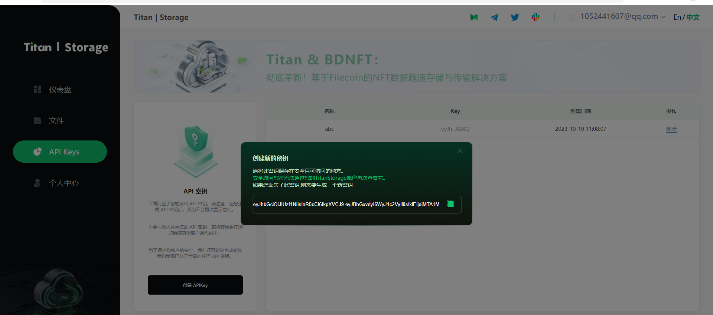

# titan-storage
Titan Storage is an advanced cloud storage application, integrating a visual interface with efficient functionality. Through our SDK, both developers and enterprises can easily integrate and utilize its features.

## Test
### 1 Build
    git clone https://github.com/zscboy/titan-game-sdk.git
    cd /titan-game-sdk/storage/example
    go build

### 2 Register from https://storage.titannet.io, and create API Key

### 3 upload file
    ./example --api-key YOUR-API-KEY --locator-url https://locator.titannet.io:5000/rpc/v0 YOUR-FILE

## Usage
